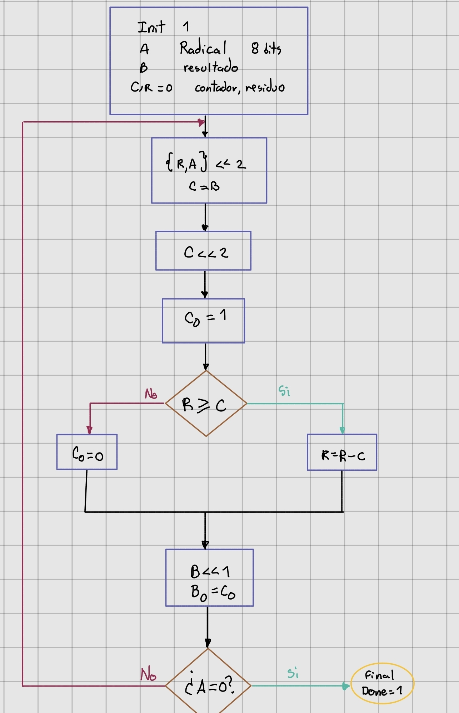
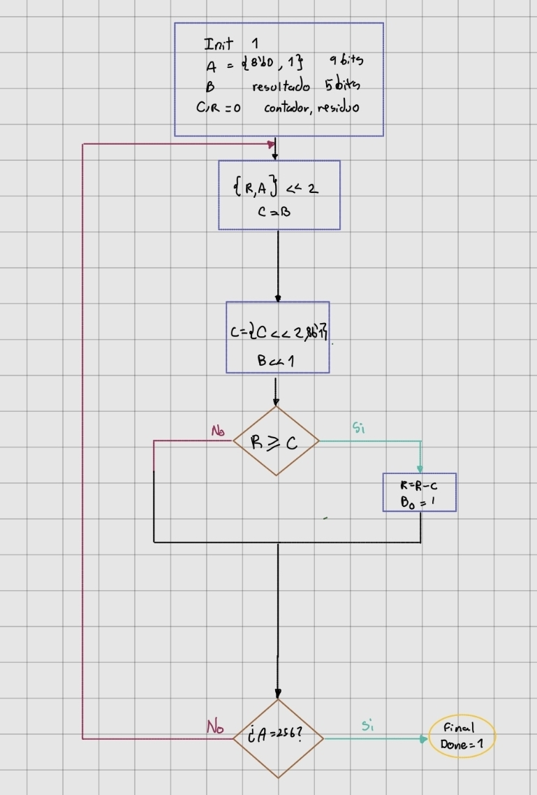
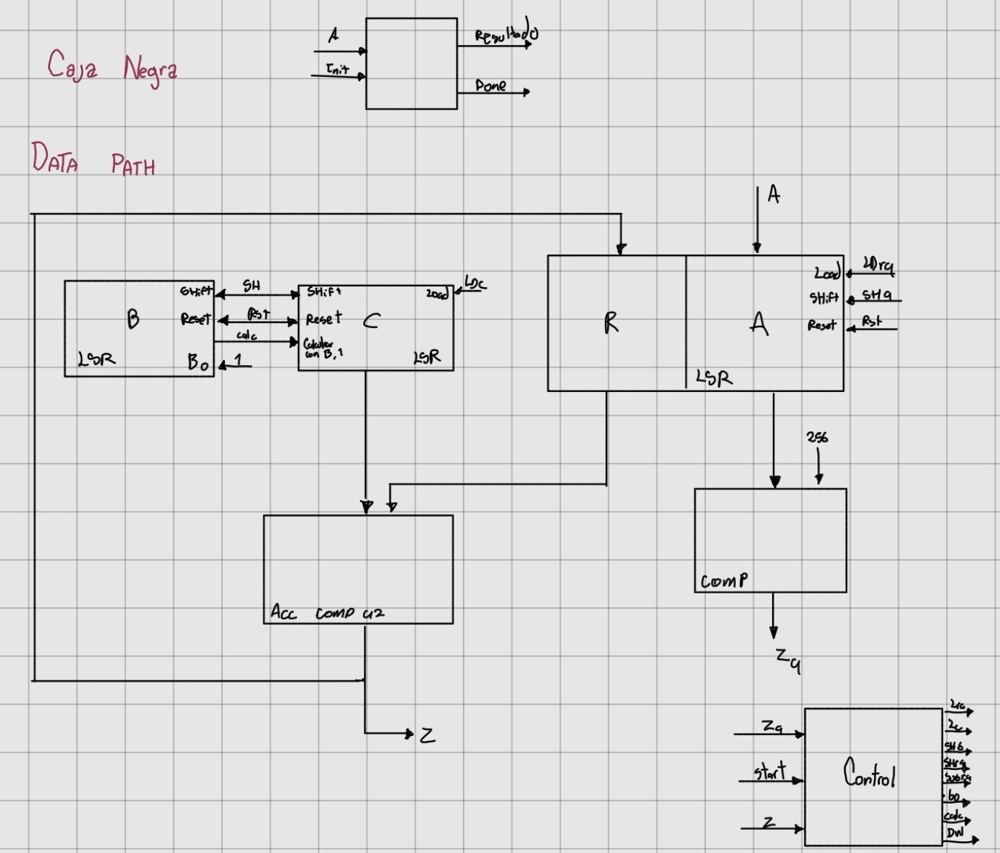
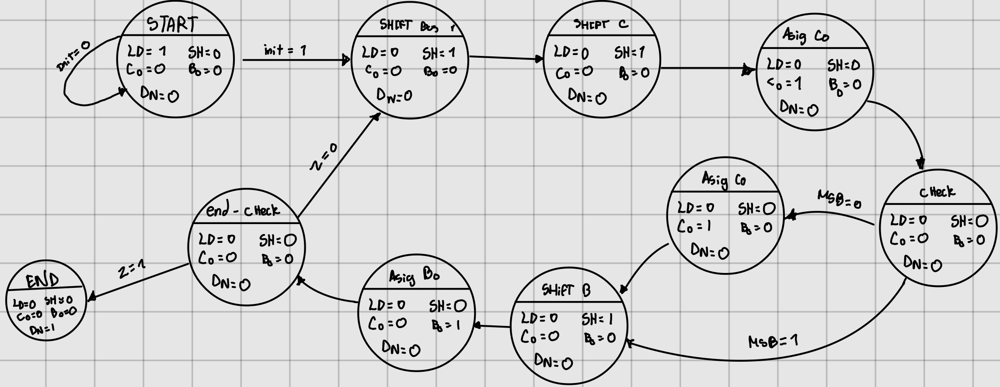
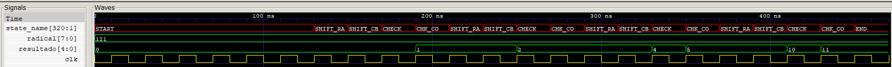

# Diseño de la raiz cuadrada

## Diagrama de flujo

### Primera version

El primer algoritmo que se penso funcionaba bien pero solo para numeros qu no terminaran en dos ceros por tanto se identifico el fallo y se re escribio.
### Version final

## Caja negra y Datapath

	
## Diagrama de estados

## Simulación 

