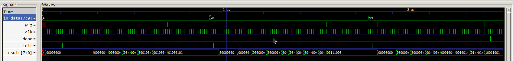

# Diseño Binario-BCD

## Diagrama de flujo 

### Primera version

El primer algoritmo se penso de manera que al ingresar información se analizaba cada numero, luego se multiplicaba por 10 (desplazamiento <<2) y luego se escribia el numero 
### Version final v1

### Version final v2
Se quieto el registro y se controla por la señal de LD_ACC para cargar los cambios en el registro R0 con la retroalimentación de los sumadores

## Simulación 

