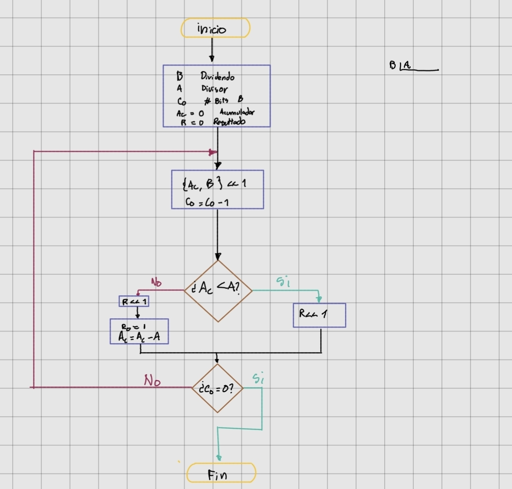
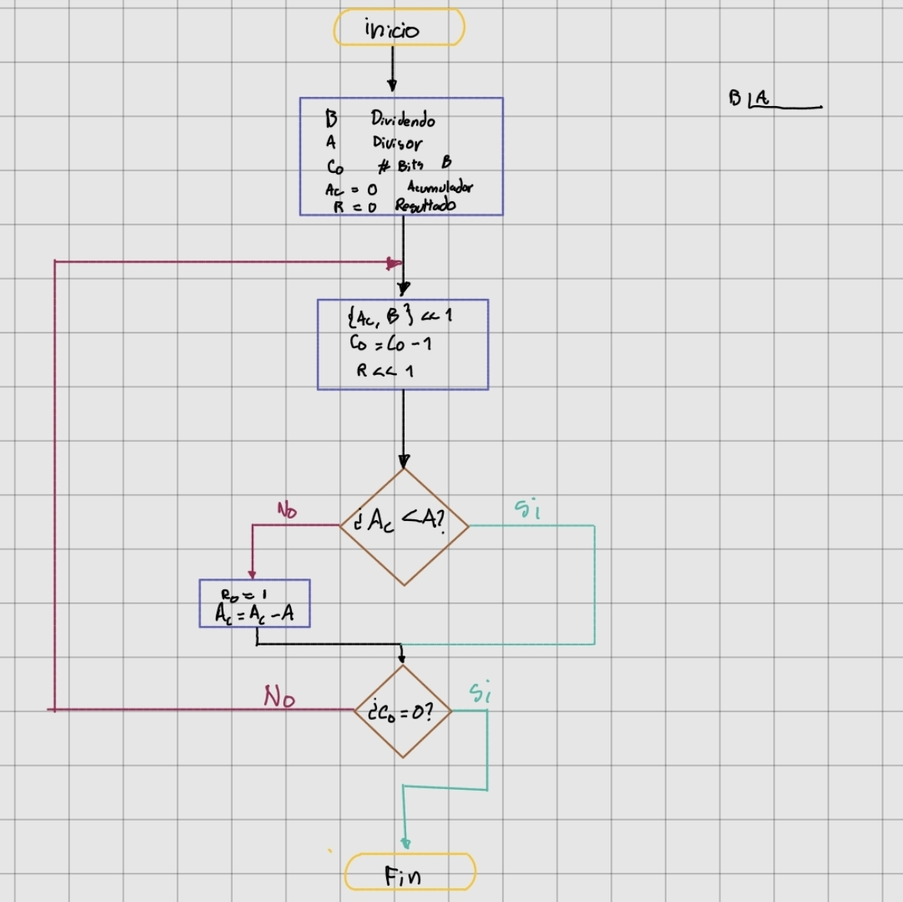
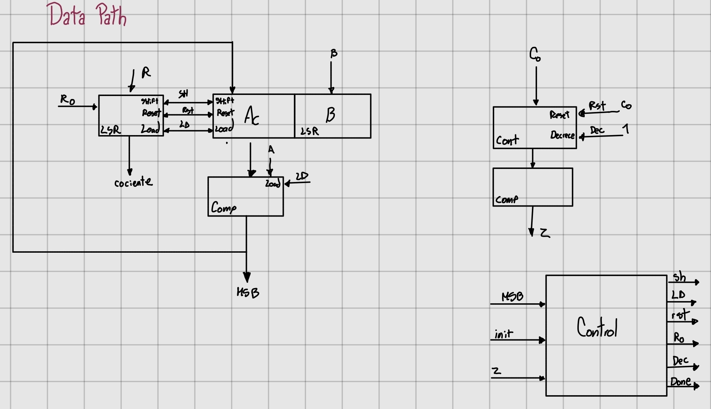
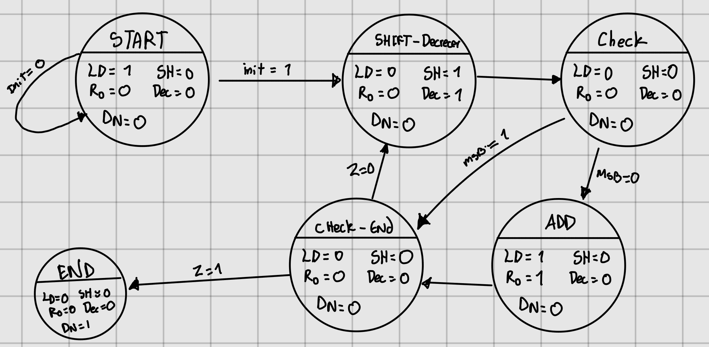
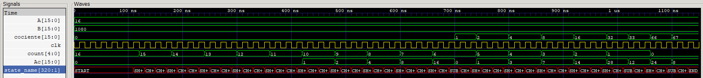

# Diseño del divisor 

## Diagrama de flujo

### Primera version

Aunque este diagrama de flujo era funcional, se observa que la repeticion del corrimiento de la variable R por tanto se modifica para que la accion solo se de en un lugar.

### Version final

## Caja negra y Datapath

	
## Diagrama de estados

## Simulación 

