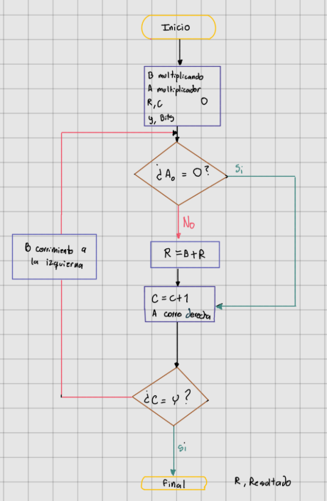
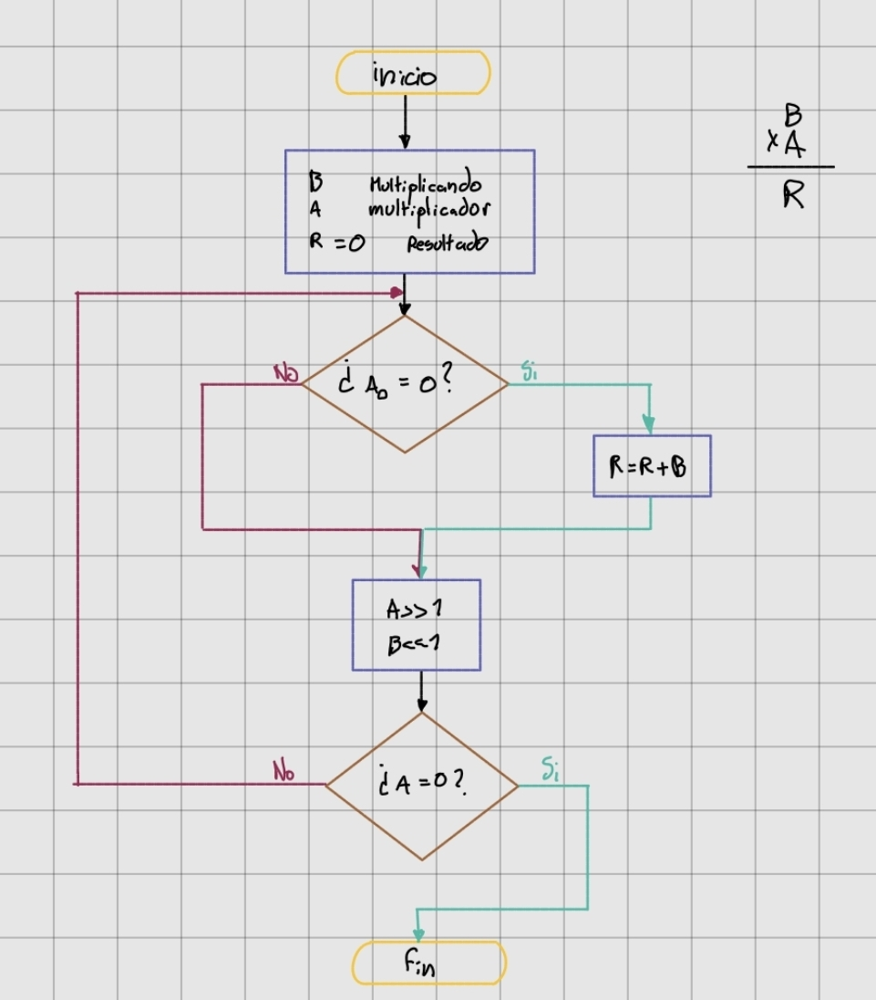
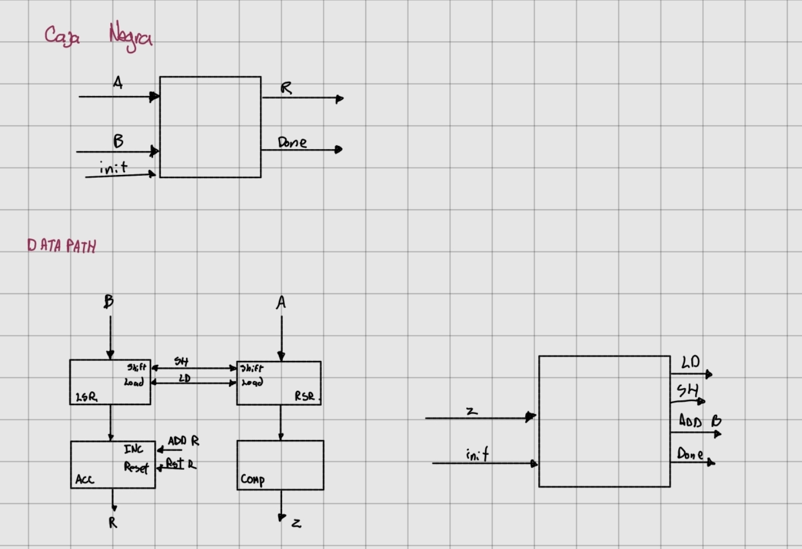
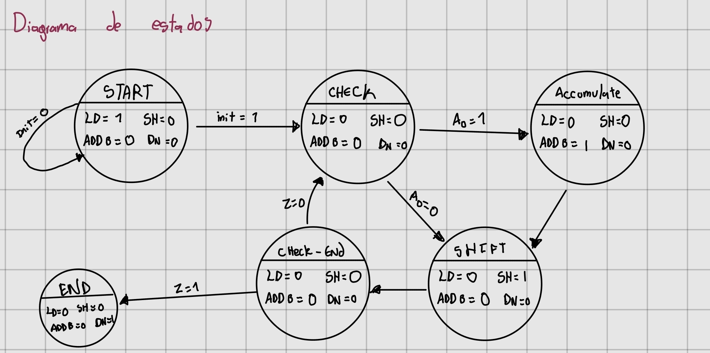
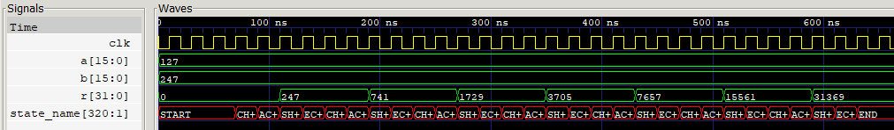

# Diseño del multiplicador

## Diagrama de flujo

### Primera version

Aunque este diagrama de flujo era funcional, se penso una forma de optimizarlo. De tal forma no se necesitaria ni la variable c ni la variable y.

### Version final

## Caja negra y Datapath

	
## Diagrama de estados

## Simulación 

